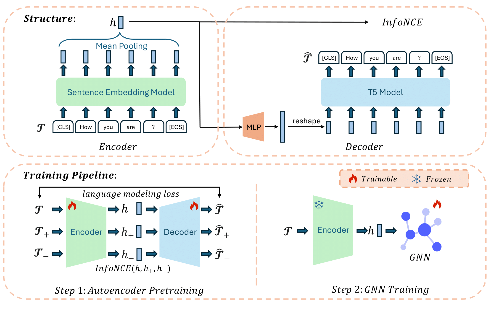

# Node Level Graph Autoencoder: Unified Pretraining for Textual Graph Learning


This is the official repository of NodeGAE. Resoureces: [[paper]](https://arxiv.org/abs/2408.07091)

 

```bibtex
@misc{hu2024nodelevelgraphautoencoder,
      title={Node Level Graph Autoencoder: Unified Pretraining for Textual Graph Learning}, 
      author={Wenbin Hu and Huihao Jing and Qi Hu and Haoran Li and Yangqiu Song},
      year={2024},
      eprint={2408.07091},
      archivePrefix={arXiv},
      primaryClass={cs.LG},
      url={https://arxiv.org/abs/2408.07091}, 
}
```


## Results
For node classification (test accuracy%):
| GNN | ogbn-arxiv|
|----|----|
| MLP  | 73.71 ± 0.10 | 
| RevGAT  | 78.34 ± 0.06 (new SOTA, 01/08/2024) |  

| GNN | ogbn-products | 
|----|----|
| MLP  | 84.20 ± 0.22|
| GAMLP  | 86.32 ± 0.09| 

For link prediction (ROC-AUC%):
| GNN | ogbn-arxiv |
|----|----|
| MLP  | 99.31 ± 0.01 | 
| GraphSage  | 98.28 ± 0.06 | 

## Reproducibility

### Environment
```bash
conda install pytorch==1.13.1 torchvision==0.14.1 torchaudio==0.13.1 pytorch-cuda=11.7 -c pytorch -c nvidia
conda install pyg -c pyg
conda install -c dglteam/label/cu117 dgl
pip install transformer
pip install ogb
```

### Data Preparation
For ogbn-arxiv dataset:
```bash
python src/dataset/arxiv_data.py
wget -O datasets/ogbn_arxiv/titleabs.tsv.gz https://snap.stanford.edu/ogb/data/misc/ogbn_arxiv/titleabs.tsv.gz
```

### Run the code
*Step 1*: Train an autoencoder.  
(Note: train autoencoders for node classification and link prediction seperately.)  
For node classification:  
```bash
cd src/feature_extractor/autoencoder/vec2text

python run.py --per_device_train_batch_size 16 \--per_device_eval_batch_size 16 --max_seq_length 256 \--model_name_or_path t5-base --dataset_name hubin/arxiv_title_abstract_all_for_train --embedder_model_name gtr_base \--num_repeat_tokens 16 --embedder_no_grad True --num_train_epochs 100 --max_eval_samples 500 \--eval_steps 2000 --warmup_steps 10000 --bf16=1 --use_wandb=0 --use_frozen_embeddings_as_input False \--experiment inversion --lr_scheduler_type constant_with_warmup --exp_group_name arxiv-gtr \--learning_rate 0.0001 --output_dir ./saves/autoencoder --save_steps 5000 --overwrite_output_dir --use_infonce_loss --auto_encoder_name  sentence-transformers/sentence-t5-base --infonce_loss_weight  1.0
```
For link prediction: just add the augment `--is_link_prediction`.  

*Step 2*: Obtain the feature embeddings from trained frozen encoder.  
```bash
cd src/feature_extractor/autoencoder/vec2text

python feature_extractor.py --model_path saves/autoencoder/checkpoint-$iteration --save_path ../../../../emb/nodegae_feature_emb.pt
```

*Step 3*. Train a classifier with the output feature embeddings.  
I. For node classfication:
```bash
# mlp
python -m src.classifier.node_classification.mlp_node_cls \
--emb_path  emb/nodegae_feature_emb.pt \
--lr 0.01 \
--hidden_size_gnn 256

# sage
python -m src.classifier.node_classification.gnn_node_cls \
--emb_path  emb/nodegae_feature_emb.pt \
--lr 0.01 \
--hidden_size_gnn 256

# revgat
output_dir=.cache_revgat/autoencoder
ckpt_dir=${output_dir}/ckpt
mkdir -p ${output_dir}
mkdir -p ${ckpt_dir}
bert_x_dir=emb/nodegae_feature_emb.pt
python -m src.gnn.node_classification.revgat.main \
    --use-norm \
    --no-attn-dst \
    --mode teacher \
    --gpu 0 \
    --dropout 0.58 \
    --edge-drop 0.46 \
    --group 1 \
    --input-drop 0.37 \
    --label_smoothing_factor 0.02 \
    --n-heads 2 \
    --n-hidden 256 \
    --n-label-iters 2 \
    --n-layers 2 \
    --use-labels \
    --use_bert_x \
    --bert_x_dir $bert_x_dir \
    --ckpt_dir $ckpt_dir \
    --output_dir $output_dir \
    --save_pred \
    --n-runs 10 \
    --kd ${output_dir}/kd
```
II. For link prediction:  
```bash
# mlp
python -m src.classifier.link_prediction.mlp_link_pred \
--emb_path emb/nodegae_feature_emb.pt \
--lr 0.01 \
--hidden_size_gnn 256 \
--batch_size 1024

# sage
python -m src.classifier.link_prediction.gnn_link_pred \
--emb_path emb/nodegae_feature_emb.pt \
--lr 0.01 \
--hidden_size_gnn 256 \
--batch_size 1024
```

For reproducing the SOTA accuracy on arxiv, run the command for ensembling:
```bash
bash scripts/classifier/revgat/ensemble.sh
```
To run code for other settings, please nevigate to `scripts` directory.


